## 目录
- [1.合成数据集](#1合成数据集)
- [2.真实数据集](#2真实数据集)
  - [2.1.基准数据集](#21基准数据集)
  - [2.2.其它真实数据集](#22其它真实数据集)

## 1.合成数据集
- **文本识别需要大量的数据, 所以合成数据集常用来做预训练**
  
|数据集|简介|例子|下载链接|
|----|----|----|----|
|SynthText|**9百万** 从8百万个常见英语单词中合成文本图像 文字通过随机变换渲染到自然图像上|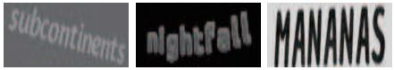|[Scene text datasets(提取码:emco)](https://pan.baidu.com/s/1PBJf-BtFa7mLkltIfTXPhQ)|
|MJSynth|**6百万** 从9万个常见英语单词中合成文本图像 文字通过随机变换渲染到自然图像上|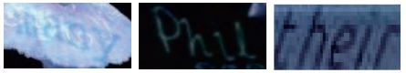|[Scene text datasets(提取码:emco)](https://pan.baidu.com/s/1PBJf-BtFa7mLkltIfTXPhQ)|
|SynthAdd|**160万** 同样用SynthText引擎生成, 用来合成标点符号等稀缺字符.||[Scene text datasets(提取码:627x)](https://pan.baidu.com/s/1uV0LtoNmcxbO-0YA7Ch4dg)|
|Synthetic Chinese String Dataset|**360万** 数据利用中文语料库（新闻 + 文言文），通过字体、大小、灰度、模糊、透视、拉伸等变化随机生成. 包含汉字、英文字母、数字和标点共5990个字符, 图片分辨率统一为280x32||[Scene text datasets(提取码:lu7m)](https://pan.baidu.com/s/1QkI7kjah8SPHwOQ40rS1Pw)|

## 2.真实数据集
### 2.1.基准数据集
- **基准数据集通常用来衡量识别器在真实场景中的性能**

|数据集|简介|例子|下载链接|
|----|----|----|----|
|**IIIT5k-Words(IIIT5K)**|**3000** 测试图像. 从街景和原始数字图像中获得|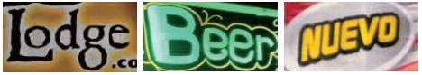|[Scene text datasets(提取码:emco)](https://pan.baidu.com/s/1PBJf-BtFa7mLkltIfTXPhQ)|
|**Street View Text(SVT)**|**647** 测试图像. 一些图像由于噪声、模糊和低分辨率等原因识别较为困难|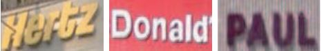|[Scene text datasets(提取码:emco)](https://pan.baidu.com/s/1PBJf-BtFa7mLkltIfTXPhQ)|
|**StreetViewText-Perspective(SVT-P)**|**639** 测试图像.  该数据集专门用于评估文本识别器在透视扭曲图像上的性能. 该数据集是在原始SVT数据集的基础上，通过在谷歌街景上选择相同地址但视角不同的图像构建的。因此，大多数文本图像由于非正面视角采集严重扭曲。||[Scene text datasets(提取码:emco)](https://pan.baidu.com/s/1PBJf-BtFa7mLkltIfTXPhQ)|
|**ICDAR 2003(IC03)**|**867** 测试图像|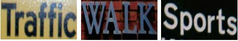|[Scene text datasets(提取码:mfir)](https://pan.baidu.com/s/1PBJf-BtFa7mLkltIfTXPhQ)|
|**ICDAR 2013(IC13)**|**1015** 测试图像|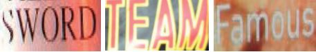|[Scene text datasets(提取码:emco)](https://pan.baidu.com/s/1PBJf-BtFa7mLkltIfTXPhQ)|
|**ICDAR 2015(IC15)**|**2077** 测试图像. 由于文字图片是谷歌眼镜在不保证图片质量的情况下拍摄的，所以大部分文字非常小、模糊、多方向的|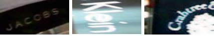|[Scene text datasets(提取码:emco)](https://pan.baidu.com/s/1PBJf-BtFa7mLkltIfTXPhQ)|
|**CUTE80(CUTE)**|**288** 该数据集专门用于评估曲型文本识别。该数据集中的大多数图像背景复杂、透视扭曲且分辨率低||[Scene text datasets(提取码:emco)](https://pan.baidu.com/s/1PBJf-BtFa7mLkltIfTXPhQ)|
****
### 2.2.其它真实数据集
  
|数据集|简介|例子|下载链接|
|----|----|----|----|
|**COCO-Text**|**39K** 从MS COCO数据集中创建. 由于MS COCO 数据集不是为文本识别而设计，所以COCO中存在大量的遮挡和低分辨率的图像。| 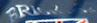 |[Others(提取码:DLVC)](https://pan.baidu.com/s/1o-7-zyUnwo44M4P6SzFkpg)|
|**RCTW**|**8186 in English**. RCTW数据集是由阅读自然场景中文文字比赛构建而来。这里选择的是英文文本部分|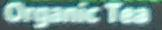|[Others(提取码:DLVC)](https://pan.baidu.com/s/1o-7-zyUnwo44M4P6SzFkpg)|
|**Uber-Text**|**92K**. 该数据集从必应地图街景中收集而来Collecetd from Bing Maps Streetside. 许多是门牌号，有些是招牌上的文字|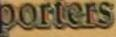|[Others(提取码:DLVC)](https://pan.baidu.com/s/1o-7-zyUnwo44M4P6SzFkpg)|
|**Art(contain Total Text,SCUT-CTW1500,Baidu Curve Scene Text)**|**29K**. Art数据集是为识别任意形状的文本而构建. 许多图像是透视或弯曲文本. 该数据集还包含 Totaltext 和 CTW1500, 其中包含许多旋转、弯曲的文本|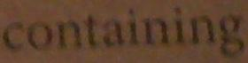|[Others(提取码:DLVC)](https://pan.baidu.com/s/1o-7-zyUnwo44M4P6SzFkpg)|
|**LSVT**|**34K in English**. LSVT 是一个大规模街景文本数据集，收集自中国的街道。这里选择的是英文文本部分||[Others(提取码:DLVC)](https://pan.baidu.com/s/1o-7-zyUnwo44M4P6SzFkpg)|
|**MLT19**|**46K in English**. MLT19 是为了识别多语言文本而创建。 它由十种语言组成：中文、日语、韩语、英语、法语、阿拉伯语、意大利语、德语、孟加拉语和印地语. 这里选择的是英文文本部分|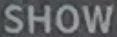|[Others(提取码:DLVC)](https://pan.baidu.com/s/1o-7-zyUnwo44M4P6SzFkpg)|
|**ReCTS**|**23K in English**. ReCTS 是为识别招牌上的中文文本比赛而创建的. 它包含许多以各种版式或用独特字体书写的不规则文本。这里选择的是英文文本部分|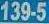|[Others(提取码:DLVC)](https://pan.baidu.com/s/1o-7-zyUnwo44M4P6SzFkpg)|
|**TextOCR**|**90K in English**. TextOCR 数据集是为识别任意形状的文本而构建的. 它包含许多不规则文本 ||[Others(提取码:DLVC)](https://pan.baidu.com/s/1o-7-zyUnwo44M4P6SzFkpg)|
|**SCOIE 2019**|**1k 英文票据数据**.该数据集包含1000张国际票据扫描图像，其中600张用作训练数据，400张为测试数据.||[Others](https://tianchi.aliyun.com/competition/entrance/231684/information)|
|**COCO-Text V2.0**|**230k 英文数据**.该数据集包含63686张原始图像24万个文本图像，标签中由文本图像的mask，每个文本都有三个属性：印刷与手写，清晰与难以辨认，英语与非英语.||[Others](https://tianchi.aliyun.com/competition/entrance/231684/information)|
|**OpenVINO**||||
|**FSNS**||||
|**百度中文场景文字识别技术创新大赛**|**290k 中文数据**. 数据集共包括约29万张图片，其中21万张图片作为训练集，8万张作为测试集。所有图像都经过一些预处理，将文字区域利用仿射变化，等比映射为一张高为48像素的图片.|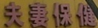|[Others](https://aistudio.baidu.com/aistudio/datasetdetail/8429)|
|**百度中文场景文字识别常规赛**|**60k 中文数据**. 百度中文场景文字识别常规赛数据集共包括6万张图片，其中5万张图片作为训练集，1万张作为测试集。数据集采自中国街景，并由街景图片中的文字行区域（例如店铺标牌、地标等等）截取出来而形成.|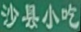|[Others](https://aistudio.baidu.com/aistudio/competition/detail/20/0/task-definition)|
|**百度轻量级文字识别技术创新大赛**|**120k 中文数据**. 百度中文场景文字识别常规赛数据集共包括12万张图片，其中10万张图片作为训练集，2万张作为测试集。数据集既有来自街景的图片（例如店铺标牌、地标等），也有来自文档、网图截取的图片。||[Others](https://aistudio.baidu.com/aistudio/competition/detail/20/0/task-definition)|
|**MTWI 2018**|**20k 中文数据**.该数据集基于网络图片的中英混合数据集，数据量充分，涵盖几十种字体，几个到几百像素字号，多种版式，较多干扰背景.||[Others](https://tianchi.aliyun.com/competition/entrance/231684/information)|
|**TC-STR **|**7k 繁体中文数据**.该数据集为繁体中文数据集，从谷歌图片中收集1554张图像生成了7543张文本图像||[Others](https://github.com/gitycc/traditional-chinese-text-recogn-dataset)|